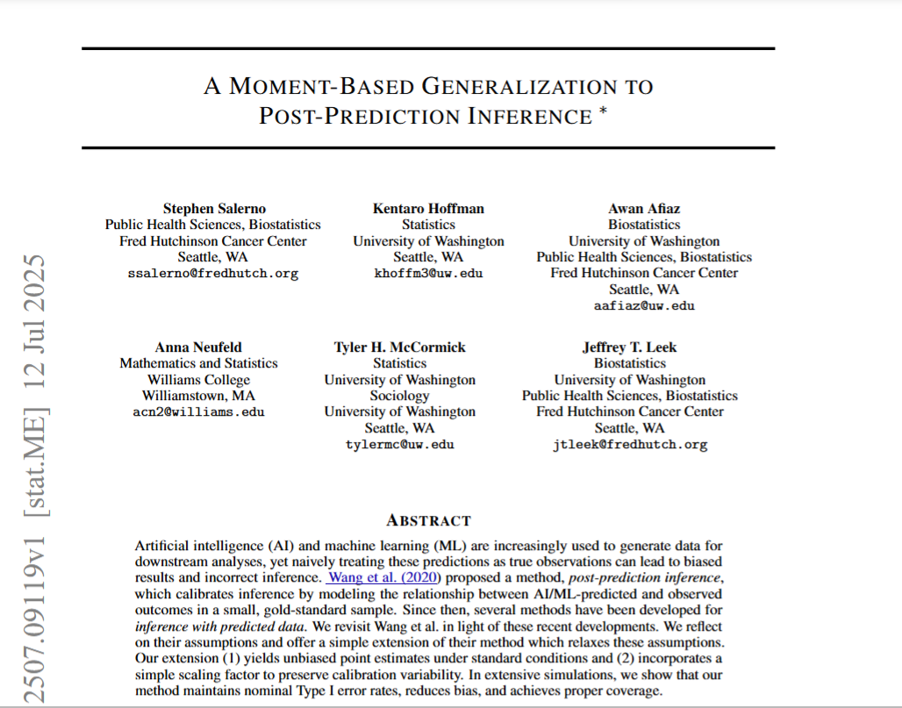
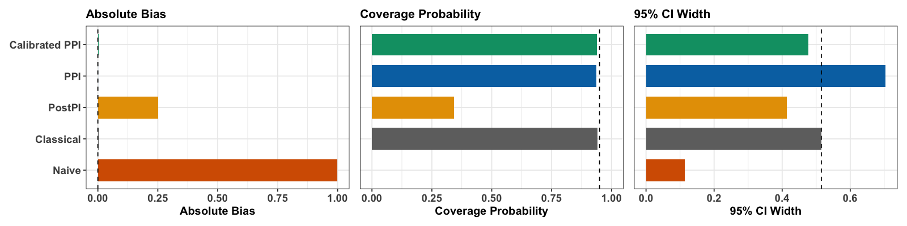
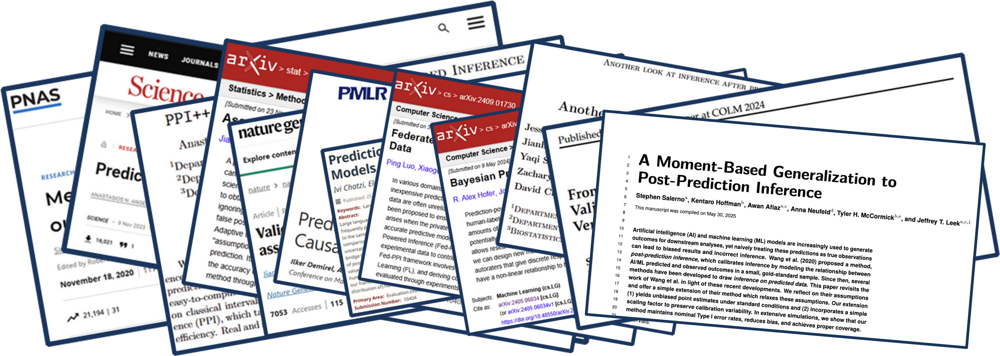
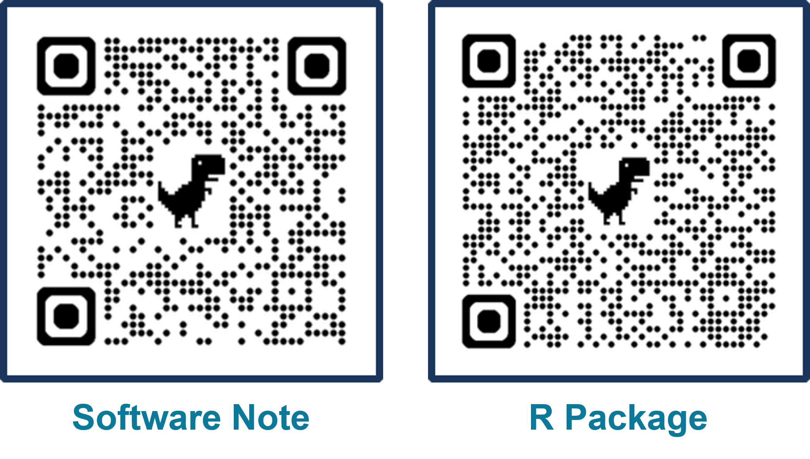
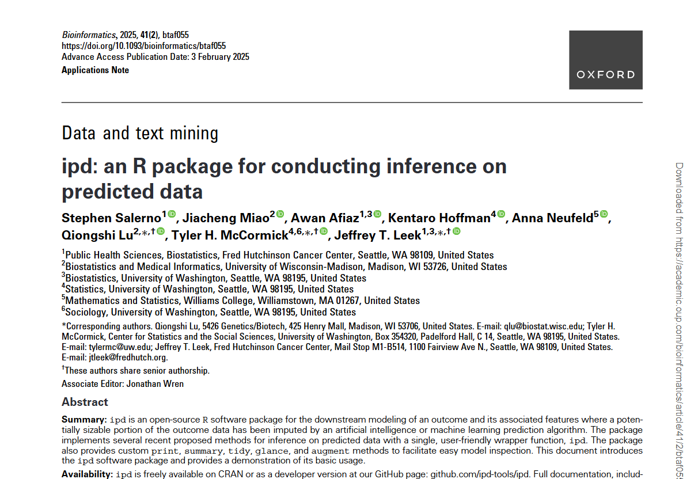
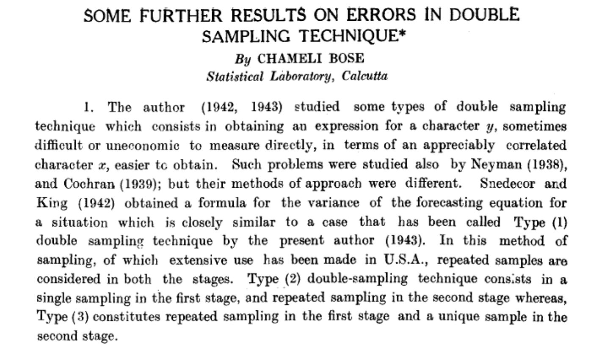

## QR code to follow along on your device {.theme-bg3}

<br>

{width="35%" fig-align="center"}

::: footer
[salernos.github.io/2026-I2DB](salernos.github.io/2026-I2DB)
:::

## First, Some Acknowledgements {.theme-bg3}

<br>

{width="50%" fig-align="center"}

## Public Health in a World Where We Can Predict Anything {.theme-bg3}

## Public Health in a World Where We [*Think We*]{style="color: #00C1D5;"} Can Predict Anything {.theme-bg3}

## Public Health in a World Where We Can [*Try to*]{style="color: #00C1D5;"} Predict Anything {.theme-bg3}

##  {visibility="hidden"}

::: kicker
Predictions are becoming part of public health data.

If we treat predictions like measurements, we get [**confident**]{style="color: #00C1D5;"} answers to the [**wrong**]{style="color: #00C1D5;"} questions.
:::

## A high-level overview of this talk {.theme-bg3}

<br>

::::: columns
::: {.column width="55%"}
<br>

- AI-generated [*predictions*]{style="color: #00C1D5;"} are becoming ubiquitous in public health
- This is changing how we [*generate evidence*]{style="color: #00C1D5;"} and [*make decisions*]{style="color: #00C1D5;"}
- Today I will focus just on [*statistical inference*]{style="color: #00C1D5;"} with predicted 'data'
- My broader research interacts with AI [*across the scientific pipeline*]{style="color: #00C1D5;"}
:::

::: {.column width="45%"}
![[Image Generated by GPT 5.6]{.caption}](images/talk_overview.png)
:::
:::::

# Thinking of AI as an *exposure* {.theme-bg2 visibility="hidden"}

## AI behaves like an exposure {.theme-bg3 visibility="hidden"}

### We need to think of AI 'emissions' like an epidemiologist

<br>

::::: columns
::: {.column width="60%"}
<br>

- It is spreading rapidly across science and society
- It spans individuals, institutions, and populations
- It influences public health research and practice
- It has the capacity to do good or harm
:::

::: {.column width="40%"}
![[Preprint provided by the authors]{.caption}](images/epi_ai_paper.PNG){width="120%"}
:::
:::::

##  {visibility="hidden"}

::: callout-note
## A working definition of AI as an exposure (Parikh et al.)

A human-designed machine-based system that, for a given set of human-defined objectives, can make [*predictions*]{style="color: #00C1D5;"}, recommendations, or decisions influencing real or virtual environments.
:::

## Why this definition matters for public health {.theme-bg3 visibility="hidden"}

### It emphasizes three key features:

<br>

1.  AI systems are [*machine-based*]{style="color: #00C1D5;"}
2.  They operate in pursuit of explicit or implicit [*objectives*]{style="color: #00C1D5;"} that are [*human-defined*]{style="color: #00C1D5;"}
3.  They act in ways that [*shape the environments*]{style="color: #00C1D5;"} in which people live and work

::: fragment
*...and it situates AI within the broader literature on determinants of health*
:::

## LLM breakthroughs have driven AI's current evolution {.theme-bg3}

<br>

![[Source: medium.com/@lmpo/a-brief-history-of-lmms-from-transformers-2017-to-deepseek-r1-2025-dae75dd3f59a]{.caption}](images/llm_breakthroughs.png)

## AI is a *highly infectious* exposure {.theme-bg3}

### And it is spreading faster than ever

<br>

![[Source: https://www.nebuly.com/blog/2024-the-year-of-llm-user-intelligence]{.caption}](images/ai_spread.png){width="50%" fig-align="center"}

## AI is already reshaping scientific discovery {.theme-bg3}

### 2024 Nobel Prizes in biology and chemistry went to AI breakthroughs

<br>

::::: columns
::: {.column width="50%"}
![[Source: nature.com/articles/s41746-024-01345-9]{.caption}](images/nobel_two.png){width="75%" fig-align="center"}
:::

::: {.column width="50%"}
![[Source: nature.com/articles/d41586-024-03214-7]{.caption}](images/AlphaFold1.png){width="65%" fig-align="center"}
:::
:::::

# Why is this happening now? {.theme-bg2}

## Certain data are becoming cheap and scalable {.theme-bg3}

### Driven by simultaneous revolutions in computing and biology

<br>

::::: columns
::: {.column width="50%"}
![[Source: https://www.ark-invest.com/articles/analyst-research/ai-training]{.caption}](images/revolution1.png){fig-align="center"}
:::

::: {.column width="50%"}
![[Source: https://digitalfoodlab.com/graph-week-genome-sequencing-price-going/]{.caption}](images/revolution2.png){fig-align="center"}
:::
:::::

::: {.footer font-size="0.75em !important"}
Adapted from *Post-prediction inference*. Source: jtleek.com/talks
:::

## But important public health outcomes remain difficult to measure {.theme-bg3}

### Many outcomes we care about are:

<br>

::::::::: {layout="[[1,1,1],[1,1,1]]"}
::: {.fragment fragment-index="1"}
[*Expensive*]{style="color: #00C1D5;"}:

Adiposity via dual-energy X-ray absorptiometry scans
:::

::: {.fragment fragment-index="3"}
[*Difficult to observe*]{style="color: #00C1D5;"}:

Disease incidence with incomplete testing
:::

::: {.fragment fragment-index="5"}
[*Never recorded*]{style="color: #00C1D5;"}:

Causes of death without medical certification
:::

::: {.fragment fragment-index="2"}
![[Source: my.clevelandclinic.org/health/diagnostics/10683-dexa-dxa-scan-bone-density-test]{.caption}](images/dexa.jpg)
:::

::: {.fragment fragment-index="4"}
![[Source: onlinelibrary.wiley.com/doi/pdf/10.1111/joim.13213]{.caption}](images/covid_testing.PNG)
:::

::: {.fragment fragment-index="6"}
![[Source: papp.iussp.org/sessions/papp104_s01/PAPP104_s01_080_010.html]{.caption}](images/va_map.png)
:::
:::::::::

## What does this mean for how we collect data? {.theme-bg3 auto-animate="true"}

### A simple sample size calculation

::: {.r-fit-text text-color="#1B365D"}

$$N = \text{Sample Size}$$
:::

::: footer
Courtesy of Ingo Ruczinski
:::

## What does this mean for how we collect data? {.theme-bg3 auto-animate="true"}

### A simple sample size calculation

::: {.r-fit-text text-color="#1B365D"}

$$N = \frac{\$ \text{ You Have }}{\$ \text{ Per Sample }}$$
:::

::: footer
Courtesy of Ingo Ruczinski
:::

## Incomplete measurement shapes what we know in public health {.theme-bg3}

<br>

- Some population outcomes are missed simply because they are [*harder to measure*]{style="color: #00C1D5;"}
- Prediction creates opportunities to [*extend evidence*]{style="color: #00C1D5;"} into those gaps
- AI makes predicting 'data' increasingly [*cheap*]{style="color: #00C1D5;"}, [*scalable*]{style="color: #00C1D5;"}, and [*pervasive*]{style="color: #00C1D5;"}
- This creates a [*two-sample problem*]{style="color: #00C1D5;"}: a small amount of expensive truth and a large amount of cheap surrogate information

# Predictions replacing data are already <br> everywhere in public health {.theme-bg2}

## Neighborhood characteristics from street view images... {.theme-bg3}

<br>

::::::: columns
:::: {.column width="60%"}
::: fragment
![[Source: https://www.pnas.org/doi/abs/10.1073/pnas.1700035114]{.caption}](images/Paper1.png){width="65%" fig-align="center"}
:::
::::

:::: {.column width="40%"}
::: fragment
"We show that socioeconomic attributes such as income, race, education, and voting patterns can be inferred from cars detected in Google Street View images using deep learning."
:::
::::
:::::::

## Malnutrition risk from remotely sensed and field data... {.theme-bg3}

<br>

::::::: columns
:::: {.column width="60%"}
::: fragment
![[Source: https://www.pnas.org/doi/10.1073/pnas.2416161122]{.caption}](images/Paper2.png){width="65%" fig-align="center"}
:::
::::

:::: {.column width="40%"}
::: fragment
"We combine supervised machine learning methods and remotely sensed feature sets with time series child anthropometric data ... to generate accurate forecasts of acute malnutrition at operationally meaningful time horizons."
:::
::::
:::::::

## Poverty from satellite images of nighttime lights... {.theme-bg3}

<br>

::::::: columns
:::: {.column width="60%"}
::: fragment
![[Source: https://www.science.org/doi/10.1126/science.aaf7894]{.caption}](images/Paper3.png){width="65%" fig-align="center"}
:::
::::

:::: {.column width="40%"}
::: fragment
"With a bit of machine-learning wizardry, the combined images can be converted into accurate estimates of household consumption and assets, both of which are hard to measure in poorer countries."
:::
::::
:::::::

## Influenza activity from search/query behavior... {.theme-bg3}

<br>

::::::: columns
:::: {.column width="60%"}
::: fragment
![[Source: https://www.nature.com/articles/nature07634]{.caption}](images/Paper4.png){width="65%" fig-align="center"}
:::
::::

:::: {.column width="40%"}
::: fragment
"Here we present a method of analysing large numbers of Google search queries to track influenza-like illness in a population."
:::
::::
:::::::

## In these examples, predictions are incoporated into the data {.theme-bg3}

### In many public health settings, we have:

<br>

- An [*outcome*]{style="color: #00C1D5;"} we really care about
- Access to cheaper or more [*scalable data*]{style="color: #00C1D5;"}
- An [*algorithm*]{style="color: #00C1D5;"} that maps these data to a prediction of the outcome

## We can find examples in many fields and everywhere in between {.theme-bg3}

### Here are two very different examples from my work

<br>

::::: columns
::: {.column width="50%"}
**Complex Predictions:** When cause of death is not recorded, it is predicted from interviews

![[Source: www.who.int/publications/m/item/2022-who-verbal-autopsy-manual-for-supervisors]{.caption}](images/va_cover.png){width="50%" fig-align="center"}
:::

::: {.column width="50%"}
**Simple Predictions:** Adiposity is expensive to measure directly, so it is predicted from height and weight

![[Source: hsph.harvard.edu/news/bmi-a-poor-metric-for-measuring-peoples-health-say-experts/]{.caption}](images/bmi_cover.png){width="80%" fig-align="center"}
:::
:::::

## Less than 1/3 of deaths worldwide are assigned a medically certified cause {.theme-bg3}

### When deaths occur outside the medical system, cause of death must be *predicted* rather than observed

Verbal autopsy (VA) is a time-consuming, resource-intensive process that asks interviewees to relive their grief in detail

<br>

![[Source: https://publichealthnotes.com/verbal-autopsy-and-mpdsr/]{.caption}](images/va_overview.png)

## Recent work predicts cause of death directly from narrative interviews {.theme-bg3}

### Narrative summaries + AI/ML predictions can reduce burden compared to structured VA

<br>

![[Source: https://journals.plos.org/plosone/article?id=10.1371/journal.pone.0308452/]{.caption}](images/va_narratives.png)

## We evaluated how well AI models predict cause of death from narratives {.theme-bg3}

### Comparing methods such as KNN, SVM, BERT, and GPT-4 using only the narrative summaries

<br>

![[Source: https://openreview.net/forum?id=QbCHlIqbDJ]{.caption}](images/va_colm.png)

## Predicting cause of death using PHMRC verbal autopsy data {.theme-bg3}

### Population Health Metrics Research Consortium (PHMRC)

N = 6,763 observations from 6 sites in 4 countries; adults only, 5 cause of death labels

<br>

::::: columns
::: {.column width="50%"}
**Focusing on one site (Uttar Pradesh)**:

- GPT-4 had the highest accuracy (0.75)
- Performance was comparable to existing VA models
- GPT-4 could say 'I don't know' (1,503 / 6,763)
- Manual review confirmed these narratives contained insufficient information for COD assignment
:::

::: {.column width="50%"}
![[Source: https://openreview.net/forum?id=QbCHlIqbDJ]{.caption}](images/va_data.png)
:::
:::::

## But *prediction* is not the same as *inference* {.theme-bg3}

<br>

:::::::: columns
:::::: {.column width="50%"}
::: fragment
### A demographer's actual questions may be:

- How does cause of death vary by geography?
- Are there changes over time in those causes?
- What are the reasons underlying these effects?
:::

::: fragment
### These are inference questions

- Requires statistical and epidemiologic models
:::

::: fragment
### The challenge:

- We have *predicted,* rather than observed, cause of death
:::
::::::

::: {.column width="50%"}
*"Value of Verbal Autopsy in a Fragile Setting: Reported versus Estimated Community Deaths Associated with COVID-19, Banadir, Somalia"*

![[Source: mdpi.com/2076-0817/12/2/328]{.caption}](images/va_trend.jpg)
:::
::::::::

## Predictions also don't have to be complex to be biased {.theme-bg3}

### And importantly, this problem is not limited to AI

The case of body mass index (BMI; kg/m$^2$) as an imperfect measure of adiposity

<br>

![[Source: https://www.nytimes.com/2024/11/14/well/obesity-epidemic-america.html]{.caption}](images/bmi_overview.png)

## An 'algorithm' is just a set of steps that map inputs to outputs {.theme-bg3}

### **Gold-Standard**: Dual-Energy X-ray Absorptiometry (DXA) % body fat (\> 30% men; \> 42% women)

BMI (≥ 30 kg/m²) and waist circumference (men ≥ 102 cm; women ≥ 88 cm) are adiposity prediction 'algorithms'

<br>

![[Source: https://www.medrxiv.org/content/10.1101/2025.04.01.25325037v1.full.pdf]{.caption}](images/bmi_algorithm.png)

## We used NHANES to understand BMI/WC in population-level inference {.theme-bg3}

### BMI/WC/DXA all collected up until COVID-19, when DXA collection was suspended

<br>

::::: columns
::: {.column width="60%\""}
```{r}

#--- Load Packages

library(ipd)
library(broom)
library(scales)
library(tidyverse)

#--- Read-In Data

load("data/NHANES.RData")

#--- Define Obesity Categories

NHANES <- NHANES |>
  mutate(
    obese_BMI = BMXBMI >= 30,
    obese_WC  = case_when(
      Sex == "Male"   & BMXWAIST >= 102 ~ TRUE,
      Sex == "Female" & BMXWAIST >=  88 ~ TRUE,
      .default                          = FALSE),
    obese_DXA = case_when(
      is.na(DXDTOPF)                 ~ NA,
      Sex == "Male"   & DXDTOPF > 30 ~ TRUE,
      Sex == "Female" & DXDTOPF > 42 ~ TRUE,
      .default                       = FALSE)
  )

nhanes_long <- NHANES |>
  select(Cohort, Age, Sex, Race, obese_BMI, obese_WC, obese_DXA) |>
  pivot_longer(
    cols = starts_with("obese_"),
    names_to = "Measure",
    values_to = "Obese"
  ) |>
  mutate(
    Measure = recode(Measure,
      obese_BMI = "BMI",
      obese_WC  = "Waist Circumference",
      obese_DXA = "DXA"
    )
  ) |>
  filter(!is.na(Obese))

prop_sex <- nhanes_long |>
  group_by(Cohort, Sex, Measure, Obese) |>
  summarize(n = n(), .groups = "drop") |>
  group_by(Cohort, Sex, Measure) |>
  mutate(prop = n / sum(n))

ggplot(prop_sex, aes(x = Sex, y = prop, fill = Obese)) +
  geom_col(position = "stack") +
  facet_grid(Cohort ~ Measure) +
  scale_y_continuous(labels = percent_format(accuracy = 1)) +
  scale_fill_manual(values = c("#00C1D5", "#AA4AC4")) +
  scale_color_manual(values = c("#00C1D5", "#AA4AC4")) +
  labs(
    x     = "\nSex",
    y     = "Percent\n",
    fill  = "Obesity Status:",
    title = "Obesity Classification by Sex, Cohort, and Measure"
  ) +
  theme_minimal() +
  theme(legend.position = "bottom")

```
:::

::: {.column width="40%"}
![[Source: https://www.medrxiv.org/content/10.1101/2025.04.01.25325037v1.full.pdf]{.caption}](images/bmi_paper.png)
:::
:::::

## Mismatched quadrants suggest limitations in BMI/WC {.theme-bg3}

### BMI/WC are (at best) noisy proxies:

- Varies by sex, age, race/ethnicity, muscle mass, fat distribution
- Prediction error can be systematically related to the variables used in the downstream scientific analysis

```{r}

cutoffs <- tibble(
  label = c("BMI", "BMI", "Waist Circumference", "Waist Circumference"),
  Sex  = c("Male", "Female", "Male", "Female"),
  xint = c(30, 30, 102, 88),
  yint = c(30, 42,  30, 42)
)

NHANES |>
  filter(Cohort == "2017-2018") |>
  pivot_longer(c(BMXBMI, BMXWAIST)) |>
  mutate(
    label = case_when(
      name == "BMXBMI" ~ "BMI", name == "BMXWAIST" ~ "Waist Circumference")) |>
  ggplot(aes(x = value, y = DXDTOPF, group = Sex, fill = Sex, color = Sex)) +
    facet_wrap(~ label, scales = "free_x") +
    geom_point(alpha = 0.4) +
    geom_smooth(method = "lm") +
    geom_vline(data = cutoffs, 
      aes(xintercept = xint, color = Sex), linetype = "dashed") +
    geom_hline(data = cutoffs, 
      aes(yintercept = yint, color = Sex), linetype = "dashed") +
    scale_fill_manual(values = c("#00C1D5", "#AA4AC4")) +
    scale_color_manual(values = c("#00C1D5", "#AA4AC4")) +
    labs(
      title = "DXA % Body Fat vs BMI and WC (2017-2018)",
      x = "\nBMI (kg/m2) or Waist Circumference (cm)", y = "% Body Fat\n") +
    theme_minimal()

```

## These two examples share the same structure {.theme-bg3}

### Predictions are being used as proxies for unmeasured data

- Predictions can be scientifically [*useful*]{style="color: #00C1D5;"}
- But predictions are [*not measurements*]{style="color: #00C1D5;"}
- The [*error*]{style="color: #00C1D5;"} in a prediction can retain structure related to the variables we want to study
- That distinction matters when our goal is [*population-level inference*]{style="color: #00C1D5;"}

# Consider this setup, which might be <br> pertinent to your own work {.theme-bg2}

## We study the relationship between an outcome ($Y$) and covariates ($X$) {.theme-bg3 auto-animate="true"}

In our VA work, $Y$ is cause of death and $X$ are sociodemographic factors like age or country of origin

In our BMI work, $Y$ is true adiposity (% body fat) and $X$ are demographic factors like age or sex

<br>

::::: r-hstack
::: {.data-label .label-yf data-id="ytext"}
Outcome:
:::

::: {.data-label .label-xz data-id="xtext"}
Covariates:
:::
:::::

::::: r-hstack
::: {.data-label .label-yf data-id="ytext"}
\% Body Fat
:::

::: {.data-label .label-xz data-id="xtext"}
Age, Sex
:::
:::::

::::: r-hstack
::: {.data-box .box-yl data-id="yl"}
Y
:::

::: {.data-box .box-xl data-id="xl"}
X
:::
:::::

## We also observe predictors ($Z$) that help predict the outcome {.theme-bg3 auto-animate="true"}

In our VA work, $Z$ are our structure VA questionnaires and narrative summaries

In our BMI work, $Z$ are anthropometric measurements (height and weight)

<br>

:::::: r-hstack
::: {.data-label .label-yf data-id="ytext"}
Outcome:
:::

::: {.data-label .label-xz data-id="xtext"}
Covariates:
:::

::: {.data-label .label-xz data-id="ztext"}
Predictors:
:::
::::::

:::::: r-hstack
::: {.data-label .label-yf data-id="ytext"}
\% Body Fat
:::

::: {.data-label .label-xz data-id="xtext"}
Age, Sex
:::

::: {.data-label .label-xz data-id="ztext"}
Height, Weight
:::
::::::

:::::: r-hstack
::: {.data-box .box-yl data-id="yl"}
Y
:::

::: {.data-box .box-xl data-id="xl"}
X
:::

::: {.data-box .box-zl data-id="zl"}
Z
:::
::::::

## In many cases, covariates and predictors are cheap and easy to collect {.theme-bg3 auto-animate="true"}

### But outcomes can be expensive or difficult to measure

<br>

:::::: r-hstack
::: {.data-label .label-yf data-id="ytext"}
Outcome:
:::

::: {.data-label .label-xz data-id="xtext"}
Covariates:
:::

::: {.data-label .label-xz data-id="ztext"}
Predictors:
:::
::::::

:::::: r-hstack
::: {.data-label .label-yf data-id="ytext"}
\% Body Fat
:::

::: {.data-label .label-xz data-id="xtext"}
Age, Sex
:::

::: {.data-label .label-xz data-id="ztext"}
Height, Weight
:::
::::::

:::::: r-hstack
::: {.data-box .box-yl data-id="yl"}
Y
:::

::: {.data-box .box-xl data-id="xl"}
X
:::

::: {.data-box .box-zl data-id="zl"}
Z
:::
::::::

:::::: r-hstack
::: {.data-box .box-yu data-id="yu"}
Y
:::

::: {.data-box .box-xu data-id="xu"}
X
:::

::: {.data-box .box-zu data-id="zu"}
Z
:::
::::::

## So we generate predicted outcomes, $f(Z)$ {.theme-bg3 auto-animate="true"}

### Without making any assumptions about the quality of these predictions or the models they come from

<br>

::::::: r-hstack
::: {.data-label .label-yf data-id="ytext"}
Outcome:
:::

::: {.data-label .label-yf data-id="ftext"}
Prediction:
:::

::: {.data-label .label-xz data-id="xtext"}
Covariates:
:::

::: {.data-label .label-xz data-id="ztext"}
Predictors:
:::
:::::::

::::::: r-hstack
::: {.data-label .label-yf data-id="ytext"}
\% Body Fat
:::

::: {.data-label .label-yf data-id="ftext"}
BMI
:::

::: {.data-label .label-xz data-id="xtext"}
Age, Sex
:::

::: {.data-label .label-xz data-id="ztext"}
Height, Weight
:::
:::::::

::::::: r-hstack
::: {.data-box .box-yl data-id="yl"}
Y
:::

::: {.data-box .box-fl data-id="fl"}
f
:::

::: {.data-box .box-xl data-id="xl"}
X
:::

::: {.data-box .box-zl data-id="zl"}
Z
:::
:::::::

::::::: r-hstack
::: {.data-box .box-yu data-id="yu"}
Y
:::

::: {.data-box .box-fu data-id="fu"}
f
:::

::: {.data-box .box-xu data-id="xu"}
X
:::

::: {.data-box .box-zu data-id="zu"}
Z
:::
:::::::

## The resulting data naturally split into two samples {.theme-bg3 auto-animate="true"}

<br>

:::::::::::::::::::::::::::: columns
:::::: {.column width="20%"}
<br>

<br>

::: fragment
### Labeled Sample

$L = \{Y_i, X_i, Z_i, f(Z_i)\}_{i=1}^{n}$
:::

<br>

<br>

<br>

::: fragment
### Unlabeled Sample

$U = \{X_i, Z_i, f(Z_i)\}_{i=n+1}^{n+N}$
:::

<br>

::: fragment
Typically $n << N$
:::
::::::

::::::::::::::::::::::: {.column width="80%"}
<br>

::::::: r-hstack
::: {.data-label .label-yf data-id="ytext"}
Outcome:
:::

::: {.data-label .label-yf data-id="ftext"}
Prediction:
:::

::: {.data-label .label-xz data-id="xtext"}
Covariates:
:::

::: {.data-label .label-xz data-id="ztext"}
Predictors:
:::
:::::::

::::::: r-hstack
::: {.data-label .label-yf data-id="ytext"}
\% Body Fat
:::

::: {.data-label .label-yf data-id="ftext"}
BMI
:::

::: {.data-label .label-xz data-id="xtext"}
Age, Sex
:::

::: {.data-label .label-xz data-id="ztext"}
Height, Weight
:::
:::::::

::::::: r-hstack
::: {.data-box .box-yl data-id="yl"}
Y
:::

::: {.data-box .box-fl data-id="fl"}
f
:::

::: {.data-box .box-xl data-id="xl"}
X
:::

::: {.data-box .box-zl data-id="zl"}
Z
:::
:::::::

::::::: r-hstack
::: {.data-box .box-yu data-id="yu"}
Y
:::

::: {.data-box .box-fu data-id="fu"}
f
:::

::: {.data-box .box-xu data-id="xu"}
X
:::

::: {.data-box .box-zu data-id="zu"}
Z
:::
:::::::
:::::::::::::::::::::::
::::::::::::::::::::::::::::

<br>

::: fragment
Here we focus on settings where all $n + N$ observations are i.i.d. samples from the same target population (i.e., $Y$ is MCAR)
:::

## This illustrates a broader shift in public health {.theme-bg3 visibility="hidden"}

### The scale and diversity of AI applications is part of what makes this moment different

- Predictions are increasingly [*used as data*]{style="color: #00C1D5;"} instead of direct measurement
- These predictions become [*inputs*]{style="color: #00C1D5;"} to statistical analyses
- But [*predictions are imperfect*]{style="color: #00C1D5;"}

::: fragment
So we need methods that support valid inference with predicted data
:::

# Once predictions enter the dataset,<br> what are our options for inference? {.theme-bg2}

## The scientific target is defined in terms of the true outcome {.theme-bg3}

<br>

::: fragment
Write generally:

$$\theta_0 = \Psi(P_{Y,X})$$
:::

::: fragment
Examples:

- Population mean or prevalence
- Regression coefficient
- Risk difference
- Causal contrast
:::

## Option 1: Classical Inference {.theme-bg3}

### Use only observations with measured outcomes

For example: [$Y$]{style="color: #AA4AC4;"} = [$\beta$]{style="color: #AA4AC4;"} [$X$]{style="color: #1B365D;"} $\Leftrightarrow$ [$\text{% Body Fat}$]{style="color: #AA4AC4;"} = [$\beta$]{style="color: #AA4AC4;"} [$\text{Sex}$]{style="color: #1B365D;"}

<br>

::::::::::::::::::::::::::::: columns
::::::::::::::::::::::::::: {.column width="50%"}
::::::: r-hstack
::: {.data-label .label-yf data-id="ytext"}
Outcome:
:::

::: {.data-label .label-yf data-id="ftext"}
Prediction:
:::

::: {.data-label .label-xz data-id="xtext"}
Covariates:
:::

::: {.data-label .label-xz data-id="ztext"}
Predictors:
:::
:::::::

::::::: r-hstack
::: {.data-label .label-yf data-id="ytext"}
\% Body Fat
:::

::: {.data-label .label-yf data-id="ftext"}
BMI
:::

::: {.data-label .label-xz data-id="xtext"}
Age, Sex
:::

::: {.data-label .label-xz data-id="ztext"}
Height, Weight
:::
:::::::

::::::: r-hstack
::: {.data-box .box-yl data-id="yl"}
Y
:::

::: {.data-box .box-fl .is-faded data-id="fl"}
:::

::: {.data-box .box-xl data-id="xl"}
X
:::

::: {.data-box .box-zl .is-faded data-id="zl"}
:::
:::::::

::::::: r-hstack
::: {.data-box .box-yu .is-faded data-id="yu"}
:::

::: {.data-box .box-fu .is-faded data-id="fu"}
:::

::: {.data-box .box-xu .is-faded data-id="xu"}
:::

::: {.data-box .box-zu .is-faded data-id="zu"}
:::
:::::::

:::::: fragment
::::: bottom-metrics
::: {.metric-box .metric-green data-id="bias"}
Valid Target
:::

::: {.metric-box .metric-red data-id="precision"}
Potentially Inefficient
:::
:::::
::::::
:::::::::::::::::::::::::::

::: {.column width="50%"}
Estimate [$\hat{\beta}_{\text{lab}}$]{style="color: #AA4AC4;"} by regressing [$Y$]{style="color: #AA4AC4;"} on [$X$]{style="color: #1B365D;"}

<br>

**Advantages:**

- Targets the desired scientific quantity under MCAR labeling
- Does not rely on the predicted values

**Problems:**

- Uses only the labeled observations
- Can be inefficient when $n << N$
:::
:::::::::::::::::::::::::::::

## Option 2: Naive Inference {.theme-bg3 auto-animate="true"}

### Treat the predicted outcomes as if they were measured

For example: [$f$]{style="color: #00C1D5;"} = [$\gamma$]{style="color: #00C1D5;"} [$X$]{style="color: #1B365D;"} $\Leftrightarrow$ [$\text{BMI}$]{style="color: #00C1D5;"} = [$\gamma$]{style="color: #00C1D5;"} [$\text{Sex}$]{style="color: #1B365D;"}

<br>

::::::::::::::::::::::::::::: columns
::::::::::::::::::::::::::: {.column width="50%"}
::::::: r-hstack
::: {.data-label .label-yf data-id="ytext"}
Outcome:
:::

::: {.data-label .label-yf data-id="ftext"}
Prediction:
:::

::: {.data-label .label-xz data-id="xtext"}
Covariates:
:::

::: {.data-label .label-xz data-id="ztext"}
Predictors:
:::
:::::::

::::::: r-hstack
::: {.data-label .label-yf data-id="ytext"}
\% Body Fat
:::

::: {.data-label .label-yf data-id="ftext"}
BMI
:::

::: {.data-label .label-xz data-id="xtext"}
Age, Sex
:::

::: {.data-label .label-xz data-id="ztext"}
Height, Weight
:::
:::::::

::::::: r-hstack
::: {.data-box .box-yl .is-faded data-id="yl"}
:::

::: {.data-box .box-fl data-id="fl"}
f
:::

::: {.data-box .box-xl data-id="xl"}
X
:::

::: {.data-box .box-zl .is-faded data-id="zl"}
:::
:::::::

::::::: r-hstack
::: {.data-box .box-yu .is-faded data-id="yu"}
:::

::: {.data-box .box-fu data-id="fu"}
f
:::

::: {.data-box .box-xu data-id="xu"}
X
:::

::: {.data-box .box-zu .is-faded data-id="zu"}
:::
:::::::

:::::: fragment
::::: bottom-metrics
::: {.metric-box .metric-red data-id="bias"}
Potential Target Bias
:::

::: {.metric-box .metric-red data-id="precision"}
Overconfident Uncertainty
:::
:::::
::::::
:::::::::::::::::::::::::::

::: {.column width="50%"}
Estimate [$\hat{\gamma}_{\text{all}}$]{style="color: #00C1D5;"}, by regressing [$f$]{style="color: #00C1D5;"} on [$X$]{style="color: #1B365D;"}

<br>

**Perceived Advantages:**

- Uses the full dataset
- Can appear highly precise

**Problems:**

- May target a different scientific quantity
- Treating predictions as observed outcomes can underestimate uncertainty
:::
:::::::::::::::::::::::::::::

## What happens if we naively substitute in the predictions? {.theme-bg3}

<br>

::: fragment
The [*naive*]{style="color: #00C1D5;"} analysis targets

$$\eta_0 = \Psi(P_{f(Z),X}),$$

not necessarily

$$\theta_0 = \Psi(P_{Y,X})$$
:::

<br>

::: fragment
### High predictive accuracy does not imply $\eta_0 = \theta_0$

For inference, prediction error matters through the part of the joint distribution that defines the scientific estimand
:::

## In practice, these two approaches can lead to different conclusions {.theme-bg3}

## Inference on verbal autopsy-based cause of death classification {.theme-bg3}

<br>

```{r}

library(tidyverse)

#--- Read-In Data

va_df <- readr::read_csv("data/VA.csv", show_col_types = FALSE)

#--- Helper Parsers

# parse strings like:
# "[ 0.01435741 -0.00823518 -0.01918385  0.04426635 ]"
# or "[[ 0.0125 0.0040 -0.0294 0.0429 ]]"

parse_num_vec <- function(x) {
  x |>
    stringr::str_replace_all("\\n", " ") |>
    stringr::str_replace_all("\\(|\\)|\\[|\\]|array", " ") |>
    stringr::str_squish() |>
    stringr::str_extract_all("[-+]?[0-9]*\\.?[0-9]+(?:[eE][-+]?[0-9]+)?") |>
    purrr::pluck(1) |>
    as.numeric()
}

# parse CI columns and return a tibble with lower/upper per coefficient
# works for formats like:
# "[[[ 0.007 0.017 ]] [[-0.001 0.009]] ... ]"
# or "(array([lower...]), array([upper...]))"

parse_ci_mat <- function(x) {
  nums <- x |>
    stringr::str_replace_all("\\n", " ") |>
    stringr::str_replace_all("\\(|\\)|\\[|\\]|array", " ") |>
    stringr::str_squish() |>
    stringr::str_extract_all("[-+]?[0-9]*\\.?[0-9]+(?:[eE][-+]?[0-9]+)?") |>
    purrr::pluck(1) |>
    as.numeric()

  n <- length(nums)

  # Case 1: lower1 upper1 lower2 upper2 ...
  if (n %% 2 == 0) {
    
    half <- n / 2

    # Try "stacked lower then upper" format first
    lower1 <- nums[1:half]
    upper1 <- nums[(half + 1):n]

    # If that looks wrong, fall back to pairwise parsing
    if (all(lower1 <= upper1)) {
      tibble(conf.low = lower1, conf.high = upper1)
    } else {
      tibble(
        conf.low  = nums[c(TRUE, FALSE)],
        conf.high = nums[c(FALSE, TRUE)]
      )
    }
  } else {
    stop("Could not parse CI column: odd number of numeric entries found.")
  }
}

#--- Convert One Row Into Long Format

parse_row_results <- function(site, model,
                              baseline_pe, baseline_ci,
                              naive_pe, naive_ci,
                              ppi_pe, ppi_ci) {

  b_pe <- parse_num_vec(baseline_pe)
  n_pe <- parse_num_vec(naive_pe)
  p_pe <- parse_num_vec(ppi_pe)

  b_ci <- parse_ci_mat(baseline_ci)
  n_ci <- parse_ci_mat(naive_ci)
  p_ci <- parse_ci_mat(ppi_ci)

  stopifnot(length(b_pe) == nrow(b_ci))
  stopifnot(length(n_pe) == nrow(n_ci))
  stopifnot(length(p_pe) == nrow(p_ci))

  bind_rows(
    tibble(
      site = site,
      model = model,
      method = "True COD",
      coef_id = seq_along(b_pe),
      estimate = b_pe,
      conf.low = b_ci$conf.low,
      conf.high = b_ci$conf.high
    ),
    tibble(
      site = site,
      model = model,
      method = "VA COD",
      coef_id = seq_along(n_pe),
      estimate = n_pe,
      conf.low = n_ci$conf.low,
      conf.high = n_ci$conf.high
    ),
    tibble(
      site = site,
      model = model,
      method = "IPD Corrected",
      coef_id = seq_along(p_pe),
      estimate = p_pe,
      conf.low = p_ci$conf.low,
      conf.high = p_ci$conf.high
    )
  )
}

#--- Parse All Rows

va_plot_df <- purrr::pmap_dfr(
  va_df,
  \(site, model, baseline_pe, baseline_ci, naive_pe, naive_ci, ppi_pe, ppi_ci, ppi_lhat, ppi_se) {
    parse_row_results(
      site = site,
      model = model,
      baseline_pe = baseline_pe,
      baseline_ci = baseline_ci,
      naive_pe = naive_pe,
      naive_ci = naive_ci,
      ppi_pe = ppi_pe,
      ppi_ci = ppi_ci
    )
  }
)

#--- Coefficient Labels

va_plot_df <- va_plot_df |>
  mutate(
    coef = factor(
      coef_id,
      levels = sort(unique(coef_id)),
      labels = c("Communicable", "External", "Maternal", "Non-Communicable")
    ),
    method = factor(method, levels = c("True COD", "VA COD", "IPD Corrected"))
  )

#--- Forest Plot

va_plot_df |>
  filter(site == "dar", model == "KNN", method != "IPD Corrected") |>

  ggplot(aes(x = estimate, y = coef, xmin = conf.low, xmax = conf.high, color = method)) +
    geom_vline(xintercept = 0, linetype = 2, linewidth = 1.1, color = "gray50") +
    geom_linerange(position = position_dodge2(width = 0.5), linewidth = 5) +
    geom_point(position = position_dodge2(width = 0.5), size = 3, color = "white") +
    geom_segment(
      aes(x = 0.0325, xend = 0.005, y = 3, yend = 2.3), linewidth = 2, color = "red",
      arrow = arrow(length = unit(0.15, "cm"))) +
    geom_segment(
      aes(x = 0.065, xend = 0.07, y = 3.75, yend = 3.95), linewidth = 2, color = "red",
      arrow = arrow(length = unit(0.15, "cm"))) +
    annotate("text", x = 0.05, y = 3, fontface = "bold", color = "red",
      label = "Naive estimates\n can disagree in\n magnitude and\n significance!") +
    scale_color_manual(values = c("#AA4AC4", "#00C1D5", "#FFB500")) +
    labs(
      x = "\nLog-Odds Ratio for Age",
      y = "Cause of Death Label\n",
      title = "Multiclass Logistic Regression of COD on Age",
      subtitle = "Site: Dar es Salaam, Model: KNN",
      color = "Outcome:") +
    theme_bw(base_size = 12) +
    theme(
      panel.grid.minor = element_blank(),
      strip.background = element_rect(fill = "gray95"),
      legend.position = "bottom")

```

## And using different measures of adiposity {.theme-bg3}

<br>

```{r}

# Split NHANES into labeled (DXA available) vs unlabeled
labeled   <- NHANES |> filter(Cohort == "2017-2018")
unlabeled <- NHANES |> filter(Cohort == "2021-2023")

# Stack for PB Inference
combined <- bind_rows(
  labeled   |> mutate(set_label = "labeled"),
  unlabeled |> mutate(set_label = "unlabeled")
)

# Naive on unlabeled using BMI
naive_bmi_fit <- glm(obese_BMI ~ Sex, 
  family = binomial, data = unlabeled)
naive_bmi_df  <- broom::tidy(naive_bmi_fit) |>
  mutate(method = "BMI")

# Naive on unlabeled using WC
naive_wc_fit <- glm(obese_WC ~ Sex,
  family = binomial, data = unlabeled)
naive_wc_df  <- broom::tidy(naive_wc_fit) |>
  mutate(method = "Waist Circumference")

# Classical on labeled using DXA
class_fit <- glm(obese_DXA ~ Sex,
  family = binomial, data = labeled)
class_df  <- broom::tidy(class_fit) |>
  mutate(method = "% Body Fat")

# Combine
coef_df <- bind_rows(naive_bmi_df, naive_wc_df, class_df) |>
  filter(term != "(Intercept)") |>
  mutate(
    term = recode(term,
      "SexFemale" = "Female (vs Male)"
    ),
    method = factor(method, levels = c("BMI", "Waist Circumference", "% Body Fat"))
  )
    
# Forest plot
ggplot(coef_df, aes(x = estimate, y = term, color = method, shape = method, group = method)) +
  geom_vline(xintercept = 0, linetype = 2, linewidth = 1.1, color = "gray50") +
  geom_linerange(aes(xmin = estimate - 1.96 * std.error, xmax = estimate + 1.96 * std.error),
    position = position_dodge2(width = 0.75), linewidth = 5) +
  geom_point(position = position_dodge2(width = 0.75), size = 3, color = "white", fill = "white") +
  geom_segment(
    aes(x = -0.05, xend = -0.25, y = 1.15, yend = 1.2), linewidth = 2, color = "red",
    arrow = arrow(length = unit(0.15, "cm"))) +
  geom_segment(
    aes(x = 0.25, xend = 0.22, y = 0.95, yend = 0.85), linewidth = 2, color = "red",
    arrow = arrow(length = unit(0.15, "cm"))) +
  geom_segment(
    aes(x = 0.6, xend = 0.65, y = 1.1, yend = 1.075), linewidth = 2, color = "red",
    arrow = arrow(length = unit(0.15, "cm"))) +
  annotate("text", x = 0.3, y = 1.1, fontface = "bold", color = "red",
    label = "Opposite conclusions\n depending on outcome!") +
  scale_color_manual(values = c("#00C1D5", "#00C1D5", "#AA4AC4")) +
  scale_shape_manual(values = c(16, 17, 16)) +
  labs(
    x = "\nLog-Odds Ratio for Sex",
    y = "Covariate\n",
    title = "Logistic Regression of Obesity on Sex",
    color = "Outcome:",
    shape = "Outcome:") +
  theme_bw(base_size = 12) +
  theme(
    panel.grid.minor = element_blank(),
    strip.background = element_rect(fill = "gray95"),
    legend.position = "bottom")

```

## Predictions can change both the target and the uncertainty {.theme-bg3}

<br>

::: fragment
### Target

Prediction can change the estimand or distort relationships among variables:

$$\eta_0 \neq \theta_0$$
:::

::: fragment
### Uncertainty

Treating a prediction as observed data ignores true variability in the data and prediction uncertainty:

$$\hat{\mathrm{SE}}_{\mathrm{naive}} \text{ can be too small}$$
:::

## Option 3: We need methods for inference with predicted data (IPD) {.theme-bg3 auto-animate="true"}

### Use predictions as auxiliary information while correcting for what they miss by combining

- A small labeled sample that tells us how predictions differ from the true outcome
- A large unlabeled sample that provides scalable prediction-derived information

::::::: r-hstack
::: {.data-label .label-yf data-id="ytext"}
Y
:::

::: {.data-label .label-yf data-id="ftext"}
f
:::

::: {.data-label .label-xz data-id="xtext"}
X
:::

::: {.data-label .label-xz data-id="ztext"}
Z
:::
:::::::

::::::: r-hstack
::: {.data-label .label-yf data-id="ytext"}
True COD
:::

::: {.data-label .label-yf data-id="ftext"}
VA COD
:::

::: {.data-label .label-xz data-id="xtext"}
Age, Country of Origin
:::

::: {.data-label .label-xz data-id="ztext"}
VA Questionnaire
:::
:::::::

::::::: r-hstack
::: {.data-label .label-yf data-id="ytext"}
\% Body Fat
:::

::: {.data-label .label-yf data-id="ftext"}
BMI
:::

::: {.data-label .label-xz data-id="xtext"}
Age, Sex
:::

::: {.data-label .label-xz data-id="ztext"}
Height, Weight
:::
:::::::

::::::: r-hstack
::: {.data-box .box-yl data-id="yl"}
:::

::: {.data-box .box-fl data-id="fl"}
:::

::: {.data-box .box-xl data-id="xl"}
:::

::: {.data-box .box-zl data-id="zl"}
:::
:::::::

::::::: r-hstack
::: {.data-box .box-yu data-id="yu"}
:::

::: {.data-box .box-fu data-id="fu"}
:::

::: {.data-box .box-xu data-id="xu"}
:::

::: {.data-box .box-zu data-id="zu"}
:::
:::::::

::: fragment
**Goal:** Preserve the scientific target while potentially gaining efficiency from predictions
:::

## The first IPD approach: Post-Prediction Inference (PostPI) {.theme-bg3}

### Key Idea: A complicated prediction rule may still have a relatively simple relationship with the true outcome

<br>

::::: columns
::: {.column width="50%"}
![[Source: https://www.pnas.org/doi/abs/10.1073/pnas.2001238117]{.caption}](images/wang_all.png){fig-align="center"}
:::

::: {.column width="50%"}
![[Source: https://www.pnas.org/doi/abs/10.1073/pnas.2001238117]{.caption}](images/wang_paper.png){fig-align="center"}
:::
:::::

## PostPI calibrates the predicted outcome using the labeled data {.theme-bg3}

### By modeling the relationship between the true and predicted outcomes

<br>

:::::::::::::::::::::::::::: columns
::::::::::::::::::::::: {.column width="50%"}
::::::: r-hstack
::: {.data-label .label-yf data-id="ytext"}
Outcome:
:::

::: {.data-label .label-yf data-id="ftext"}
Prediction:
:::

::: {.data-label .label-xz data-id="xtext"}
Covariates:
:::

::: {.data-label .label-xz data-id="ztext"}
Predictors:
:::
:::::::

::::::: r-hstack
::: {.data-label .label-yf data-id="ytext"}
\% Body Fat
:::

::: {.data-label .label-yf data-id="ftext"}
BMI
:::

::: {.data-label .label-xz data-id="xtext"}
Age, Sex
:::

::: {.data-label .label-xz data-id="ztext"}
Height, Weight
:::
:::::::

::::::: r-hstack
::: {.data-box .box-yl data-id="yl"}
Y
:::

::: {.data-box .box-fl data-id="fl"}
f
:::

::: {.data-box .box-xl .is-faded data-id="xl"}
:::

::: {.data-box .box-zl .is-faded data-id="zl"}
:::
:::::::

::::::: r-hstack
::: {.data-box .box-yu .is-faded data-id="yu"}
:::

::: {.data-box .box-fu .is-faded data-id="fu"}
:::

::: {.data-box .box-xu .is-faded data-id="xu"}
:::

::: {.data-box .box-zu .is-faded data-id="zu"}
:::
:::::::
:::::::::::::::::::::::

:::::: {.column width="50%"}
::: fragment
Define the calibrated surrogate

$$g_0(Z) = g\{f(Z)\}$$

and the residual

$$r_g = Y - g_0(Z)$$
:::

<br>

::: fragment
For simple linear calibration, PostPI uses a 'relationship model'

$$g_0(Z) = \gamma_0 + \gamma_1 f(Z)$$
:::

<br>

::: fragment
Calibration attempts to make $g\{f(Z)\}$ more closely resemble the outcome
:::
::::::
::::::::::::::::::::::::::::

## PostPI then uses the calibrated prediction as a pseudo-outcome {.theme-bg3}

### And regresses $g\{f(Z)\}$ on the downstream covariates

For linear regression, $\hat{\beta}_{\text{PostPI}} = \{P_U(XX^\top)\}^{-1}P_U[X\hat{g}(Z)]$

<br>

::::::::::::::::::::::::::::: columns
::::::::::::::::::::::::::: {.column width="50%"}
::::::: r-hstack
::: {.data-label .label-yf data-id="ytext"}
Outcome:
:::

::: {.data-label .label-yf data-id="ftext"}
Prediction:
:::

::: {.data-label .label-xz data-id="xtext"}
Covariates:
:::

::: {.data-label .label-xz data-id="ztext"}
Predictors:
:::
:::::::

::::::: r-hstack
::: {.data-label .label-yf data-id="ytext"}
\% Body Fat
:::

::: {.data-label .label-yf data-id="ftext"}
BMI
:::

::: {.data-label .label-xz data-id="xtext"}
Age, Sex
:::

::: {.data-label .label-xz data-id="ztext"}
Height, Weight
:::
:::::::

::::::: r-hstack
::: {.data-box .box-yl .is-faded data-id="yl"}
:::

::: {.data-box .box-fl .is-faded data-id="fl"}
:::

::: {.data-box .box-xl .is-faded data-id="xl"}
:::

::: {.data-box .box-zl .is-faded data-id="zl"}
:::
:::::::

::::::: r-hstack
::: {.data-box .box-ytildeu data-id="yu"}
Y$^\star$
:::

::: {.data-box .box-fu .is-faded data-id="fu"}
:::

::: {.data-box .box-xu data-id="xu"}
X
:::

::: {.data-box .box-zu .is-faded data-id="zu"}
:::
:::::::

:::::: fragment
::::: bottom-metrics
::: {.metric-box .metric-green data-id="bias"}
Potentially Efficient
:::

::: {.metric-box .metric-green data-id="precision"}
Valid Under Additional Conditions
:::
:::::
::::::
:::::::::::::::::::::::::::

::: {.column width="50%"}
**Intuition:**

- Learn the relationship between $Y$ and $f(Z)$ in the labeled sample
- Transform $f(Z)$ into a calibrated pseudo-outcome
- Analyze the pseudo-outcome in the larger unlabeled sample

**Advantages:**

- Intuitive and easy to implement
- Separates prediction from downstream analysis

**Question:**

- Does outcome calibration guarantee the correct inference?
:::
:::::::::::::::::::::::::::::

## What does PostPI actually target? {.theme-bg3}

::: fragment
For linear regression, our scientific target is

$$\beta_0 = M^{-1}E(XY), \quad M = E(XX^\top)$$
:::

::: fragment
PostPI instead targets

$$\beta_g = M^{-1}E\{X g_0(Z)\}$$
:::

::: fragment
Since

$$Y = g_0(Z) + r_g,$$

we have

$$E(XY) = E\{X g_0(Z)\} + E[X r_g],$$
:::

::: fragment
so any target discrepancy is determined by the residual score $E(X r_g)$:

$$\boxed{\beta_g - \beta_0 = -M^{-1}E(X r_g)}$$
:::

## So when is PostPI valid? {.theme-bg3}

PostPI targets the desired regression coefficient if and only if

$$\boxed{E(Xr_g) = E\left[X\{Y-g_0(Z)\}\right] = 0}$$

::: fragment
But ordinary linear calibration only guarantees

$$E(r_g) = 0$$

and

$$E\{f(Z)r_g\} = 0$$
:::

::: fragment
It does **not** generally guarantee

$$E(Xr_g)=0$$

### Outcome calibration does not necessarily imply inferential validity
:::

## Prediction-Powered Inference (PPI; Angelopoulos et al., 2023) {.theme-bg3}

### Start with naive approach, then 'rectify' its bias using the difference between the predicted and measured outcomes

Guarantees inferential validity, regardless of the quality of the predictions

[$\hat{\beta^\star}$]{style="color: #AA4AC4;"} = [$\hat{\gamma}_{\text{unlab}}$]{style="color: #00C1D5;"} - ([$\hat{\gamma}_{\text{lab}}$]{style="color: #00C1D5;"} - [$\hat{\beta}_{\text{lab}}$]{style="color: #AA4AC4;"})

<br>

![[Source: science.org/doi/10.1126/science.adi6000]{.caption}](images/ppi.png)

## Prediction-Powered Inference estimates what the prediction misses {.theme-bg3}

### Instead of assuming $E(Xr_g)=0$, estimate it from the labeled sample

Start from the complete-data score:

$$E\left[X\{Y-X^\top\beta\}\right]$$

::: fragment
Decompose it as

$$\underbrace{E\left[X\{g(Z)-X^\top\beta\}\right]
}_{\text{surrogate contribution}} + \underbrace{E\left[ X\{Y-g(Z)\}\right]}_{\text{rectifier}}$$
:::

::: fragment
Then estimate

$$\boxed{P_U\left[X\{g(Z)-X^\top\beta\}\right] + P_L\left[X\{Y-g(Z)\}\right] = 0}$$

The first term uses the large unlabeled sample and the second learns what the predictions miss from the labeled sample
:::

## Why does rectification work? {.theme-bg3}

At the population level,

$$\begin{aligned}
  & E\left[X\{f(Z)-X^\top\beta\}\right] + E\left[X\{Y-f(Z)\} \right] \\[4pt]
  &= E\{Xf(Z)\} - E(XX^\top)\beta + E(XY) - E\{Xf(Z)\} \\[4pt]
  &= \boxed{ E\left[X\{Y-X^\top\beta\}\right]}
\end{aligned}$$

::: fragment
### The surrogate cancels and validity no longer requires $f$ to be the correct outcome model
:::

## Calibration and rectification solve different problems {.theme-bg3}

<br>

::::: columns
::: {.column width="50%"}
### Calibration

Changes the surrogate:

$$f(Z) \longrightarrow g\{f(Z)\}$$

**Purpose:** Improve the information supplied by the surrogate
:::

::: {.column width="50%"}
### Rectification

Retains the part of the scientific estimating equation not captured by the surrogate:

$$E(Xr_g) = E\left[ X\{Y-g(Z)\} \right]$$

**Purpose:** Protect the scientific target from residual prediction error
:::
:::::

## What happens if we rectify PostPI? {.theme-bg3}

Using PostPI's calibrated prediction $\hat{g}(Z)$,

$$P_U\left[X\{\widehat g(Z)-X^\top\beta\}\right] + P_L\left[X\{Y-\widehat g(Z)\}\right] = 0$$

::: fragment
But this is exactly the PPI estimating equation using $\hat{g}(Z)$ as the surrogate.

$$\boxed{\hat{\beta}_R = \hat{\beta}_{\mathrm{PPI}}\{\hat{g}\}}$$
:::

::: fragment
### Rectified PostPI = PPI with calibrated predictions
:::

## Revisiting PostPI clarifies how these methods fit together {.theme-bg3}

### The apparent "fix" to PostPI reveals a broader distinction between calibration and rectification

<br>

::::::: columns
::::: {.column width="55%"}
::: fragment
### Once we have a valid estimator, prediction quality becomes an efficiency question

With surrogate $g$,

$$\operatorname{Var}\{\widehat\beta_{\mathrm{PPI}}(g)\} = M^{-1}\left[\frac{\operatorname{Var}\left\{X[g(Z)-X^\top\beta_0]\right\}}{N} + \frac{\operatorname{Var}\left[X\{Y-g(Z)\}\right]}{n}\right]M^{-1}$$
:::

::: fragment
Rectification protects the target for a broad class of surrogates

Changing $g$ changes how efficiently prediction-derived information is used
:::
:::::

::: {.column width="45%"}

:::
:::::::

## A simple simulation can show this {.theme-bg3}

::::: columns
::: {.column width="50%"}
### Simulation Setup

**Covariates:**

$$\begin{pmatrix} X\\ W \end{pmatrix} \sim 
        N_2\left[\begin{pmatrix} 0\\ 0 \end{pmatrix},
            \begin{pmatrix} 1 & 0.5\\ 0.5 & 1 \end{pmatrix}\right],$$
**Outcome:**

$$Y = 2X + W + \varepsilon, \quad \varepsilon\sim N(0,1) \perp (X,W)$$

**Predictions:**

$$F = f(Z) = X + W$$
:::

::: {.column width="50%"}
### Targets of Interest

**Truth**

$$\beta_0 = \frac{\mathbb{E}[XY]}{\mathbb{E}[X^2]} = 2.5$$

**Naive:**

$$\beta_{\mathrm{naive}}=1.5$$

**PostPI:**

$$\beta_{\mathrm{PostPI}}=2.25$$

**PPI/Calibrated PPI:**

$$\beta_{\mathrm{PPI}} = \beta_{\mathrm{Calibrated\ PPI}} = 2.5$$
:::
:::::

## Validity does not guarantee efficiency {.theme-bg3}

### $n=100$ labeled, $N=900$ unlabeled

<br>

{width="100%"}

::: fragment
- Naive and PostPI: Biased with poor coverage
- Classical, PPI, and Calibrated PPI: Unbiased with nominal coverage
- But PPI can be **less efficient than labeled-only inference**
- Calibration before rectification can improve efficiency
:::

## This idea is not specific to linear regression {.theme-bg3}

Suppose the scientific target satisfies

$$E\{\phi(Y,X;\theta_0)\} = 0$$

::: fragment
For any surrogate $m(W)$,

$$\boxed{E\{\phi(Y,X;\theta)\} = E\{\phi(m(W),X;\theta)\} + E[\phi(Y,X;\theta) - \phi(m(W),X;\theta)]}$$
:::

:::::: fragment
::::: columns
::: {.column width="50%"}
### Large unlabeled sample

$$E\{\phi(m(W),X;\theta)\}$$
:::

::: {.column width="50%"}
### Small labeled sample

$$E[\phi(Y,X;\theta) - \phi(m(W),X;\theta)]$$
:::
:::::
::::::

## We developed a method for correcting inference on VA predicted COD {.theme-bg3}

### By extending the PPI framework to multiclass prediction problems

<br>

::::: columns
::: {.column width="65%"}
```{r}

#--- Forest Plot

va_plot_df |>
  filter(site == "dar", model == "KNN") |>

  ggplot(aes(x = estimate, y = coef, xmin = conf.low, xmax = conf.high, color = method)) +
    geom_vline(xintercept = 0, linetype = 2, linewidth = 1.1, color = "gray50") +
    geom_linerange(position = position_dodge2(width = 0.75), linewidth = 5) +
    geom_point(position = position_dodge2(width = 0.75), size = 3, color = "white") +
    geom_segment(
      aes(x = -0.005, xend = -0.015, y = 3.55, yend = 2.45), linewidth = 2, color = "#1B365D",
      arrow = arrow(length = unit(0.15, "cm"))) +
    geom_segment(
      aes(x = 0.02, xend = 0.025, y = 4.05, yend = 4.15), linewidth = 2, color = "#1B365D",
      arrow = arrow(length = unit(0.15, "cm"))) +
    annotate("text", x = 0, y = 4, fontface = "bold", color = "#1B365D",
      label = "Corrected estimates\n align with the truth!") +
    scale_color_manual(values = c("#AA4AC4", "#00C1D5", "#1B365D")) +
    labs(
      x = "\nLog-Odds Ratio for Age",
      y = "Cause of Death Label\n",
      title = "Site: Dar es Salaam, Model: KNN",
      color = "Outcome:") +
    theme_bw(base_size = 12) +
    theme(
      panel.grid.minor = element_blank(),
      strip.background = element_rect(fill = "gray95"),
      legend.position = "bottom")
```
:::

::: {.column width="35%"}
![[Source:arxiv.org/pdf/2404.02438]{.caption}](images/va_paper.png)
:::
:::::

## IPD correction can resolve problems with BMI/WC inference as well {.theme-bg3}

### Our corrected estimates aligns with those from gold-standard DXA-based estimates

<br>

```{r}

ipd_bmi_fit <- ipd(
    formula = obese_DXA - obese_BMI ~ Sex,
    method  = "pspa",
    model   = "logistic",
    data    = combined,
    label   = "set_label"
)

ipd_wc_fit <- ipd(
    formula = obese_DXA - obese_WC ~ Sex,
    method  = "pspa",
    model   = "logistic",
    data    = labeled,
    unlabeled_data = unlabeled
)

# Collect results using the tidy() method
ipd_bmi_df <- tidy(ipd_bmi_fit) |>
  mutate(method = "IPD Corrected BMI")

ipd_wc_df  <- tidy(ipd_wc_fit) |>
  mutate(method = "IPD Corrected Waist Circumference")

coef_df <- bind_rows(
  ipd_bmi_df, ipd_wc_df, naive_bmi_df, naive_wc_df, class_df) |>
  filter(term != "(Intercept)") |>
  mutate(
    term = recode(term,
      "SexFemale" = "Female (vs Male)"
    ),
    method = factor(method, 
      levels = c("IPD Corrected BMI", "IPD Corrected Waist Circumference", 
                 "BMI", "Waist Circumference", "% Body Fat"))
  )
    
# Forest plot
ggplot(coef_df, aes(x = estimate, y = term, color = method, fill = method, shape = method)) +
  geom_vline(xintercept = 0, linetype = 2, linewidth = 1.1, color = "gray50") +
  geom_linerange(aes(xmin = estimate - 1.96 * std.error,
                     xmax = estimate + 1.96 * std.error),
    position = position_dodge2(width = 0.75), linewidth = 5) +
  geom_point(position = position_dodge2(width = 0.75), size = 3, color = "white") +
  geom_segment(
    aes(x = -0.05, xend = -0.25, y = 1.3, yend = 1.3), linewidth = 2, color = "#1B365D",
    arrow = arrow(length = unit(0.15, "cm"))) +
  geom_segment(
    aes(x = -0.05, xend = -0.25, y = 1.2, yend = 0.85), linewidth = 2, color = "#1B365D",
    arrow = arrow(length = unit(0.15, "cm"))) +
  geom_segment(
    aes(x = -0.05, xend = -0.22, y = 1.1, yend = 0.75), linewidth = 2, color = "#1B365D",
    arrow = arrow(length = unit(0.15, "cm"))) +
  annotate("text", x = 0.3, y = 1.3, fontface = "bold", color = "#1B365D",
    label = "Corrected estimates\n align with the truth!") +
  scale_fill_manual(
    values = c(
      "% Body Fat" = "#AA4AC4", 
      "BMI" = "#00C1D5", 
      "Waist Circumference" = "#00C1D5",
      "IPD Corrected BMI" = "#1B365D",
      "IPD Corrected Waist Circumference" = "#1B365D"
    )
  ) +
  scale_color_manual(
    values = c(
      "% Body Fat" = "#AA4AC4", 
      "BMI" = "#00C1D5", 
      "Waist Circumference" = "#00C1D5",
      "IPD Corrected BMI" = "#1B365D",
      "IPD Corrected Waist Circumference" = "#1B365D"
    )
  ) +
  scale_shape_manual(
    values = c(
      "% Body Fat" = 16, 
      "BMI" = 16, 
      "Waist Circumference" = 17,
      "IPD Corrected BMI" = 16,
      "IPD Corrected Waist Circumference" = 17
    )
  ) +
  guides(
    colour = guide_legend(nrow = 2),
    fill   = guide_legend(nrow = 2),
    shape  = guide_legend(nrow = 2)) +
  labs(
    x = "\nLog-Odds Ratio for Sex",
    y = "Covariate\n",
    title = "Logistic Regression of Obesity on Sex",
    color = "Outcome:", fill = "Outcome:", shape = "Outcome:"
  ) +
  theme_bw(base_size = 12) +
  theme(
    panel.grid.minor = element_blank(),
    strip.background = element_rect(fill = "gray95"),
    legend.position = "bottom")

```

## Inference with predicted data is a rapidly growing field {.theme-bg3}

### Driven by the pace of AI/ML method development and the need for domain-specific solutions

<br>



## We developed the `ipd` R package {.theme-bg3}

### To implement these correction methods in a consistent and familiar manner

<br>

::::: columns
::: {.column width="66%"}

:::

::: {.column width="33%"}

:::
:::::

# A Broader Perspective {.theme-bg2}

## Doesn't this sound familiar? {.theme-bg3}

### Combining a little expensive truth with a lot of cheap auxiliary information is a classical statistical problem

<br>

{width="100%"}

<br>

::: fragment
### What is different is how the auxiliary information is generated and collected

In our setting, the prediction rule can be treated as a [*black box*]{style="color: #00C1D5;"}: we do not need access to the model, its training data, or its internal structure, and we make no assumptions about the functional form or quality of the predictions.
:::

## AI, like any exposure, requires different 'treatment' strategies {.theme-bg3}

### My research program takes a holistic approach to intervening across the scientific pipeline

<br>

::::::::: {layout="[[1,1,1],[1,1,1]]"}
::: {.fragment fragment-index="1"}
**Statistical Methods** (Today's Focus)

![[arxiv.org/pdf/2512.05456]{.caption}](images/rhino_paper.PNG){width="60%"}
:::

::: {.fragment fragment-index="2"}
**Open-Source Software**

![[github.com/jtleek/scorcher]{.caption}](images/scorcher_github.png)
:::

::: {.fragment fragment-index="3"}
**Free Training Resources**

![[salernos.github.io/ipd-workshop/]{.caption}](images/ipd_workshop.PNG){width="80%"}
:::

::: {.fragment fragment-index="4"}
<br>

**Open Case Studies**

![[opencasestudies.org/]{.caption}](images/ocs.PNG){width="80%"}
:::

::: {.fragment fragment-index="5"}
<br>

**Benchmark Datasets**

![[arxiv.org/pdf/2603.01343]{.caption}](images/pancanbench.PNG)
:::

::: {.fragment fragment-index="6"}
<br>

**Service**

![[data.bloomberglp.com/company/sites/2/2018/09/Data-for-Good-In-Your-Neighborhood.pdf]{.caption}](images/d4gx.PNG){width="80%"}
:::
:::::::::

## Final Thoughts {.theme-bg3}

- Artificial intelligence is an [*exposure*]{style="color: #00C1D5;"} that transforms how data are generated and analyzed
- Predictions will increasingly become [*inputs*]{style="color: #00C1D5;"} to public health research
- Ensuring that inference remains valid will require new [*methods*]{style="color: #00C1D5;"}, [*tools*]{style="color: #00C1D5;"}, and [*training*]{style="color: #00C1D5;"}
- [*Open-source collaboration*]{style="color: #00C1D5;"} is our fastest way to success!

## Thank You! {.theme-bg3}

<br>

{width="35%" fig-align="center"}

::: footer
[salernos.github.io/2026-I2DB](salernos.github.io/2026-I2DB)

[salerno.s\@wustl.edu](salerno.s@wustl.edu)
:::
